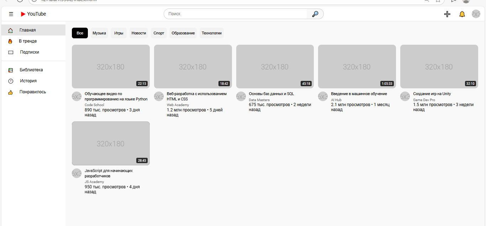
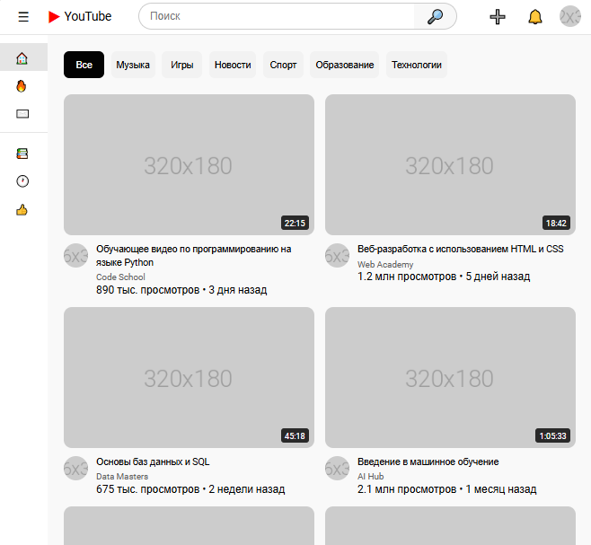
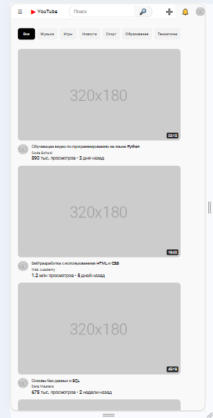

# YouTube Clone - Лабораторная работа №8-9
**Студент:** Alekseev.G.S
**Группа:** ISP-232
---
## Описание

Адаптивный клон главной
страницы YouTube, созданный с использованием HTML, CSS, Flexbox и CSS Grid.

---
## Реализованные функции
- [ ] Адаптивный хедер с поиском
- [ ] Боковая панель навигации
- [ ] Категории (чипсы) с интерактивностью
- [ ] Сетка видео с карточками
- [ ] Hover-эффекты на карточках
- [ ] Полная адаптивность под все устройства
- [ ] [Добавьте свои функции]
---
## Технологии
- HTML5
- CSS3
- Flexbox
- CSS Grid
- Media Queries
---
## Скриншоты
### Desktop (1920px)

### Tablet (1024px)

### Mobile (375px)

---
## Как запустить
1. Откройте файл `index.html` в браузере
2. Или используйте **Live Server** в VS Code:
- Установите расширение Live Server
- Правой кнопкой по `index.html` → Open with Live Server
---
## Структура проекта

## Вывод
Лично для меня стало новым только 2 строчки кода:
```CSS
    -webkit-line-clamp: 2;
    -webkit-box-orient: vertical;
```
---
## Дата выполнения
30.01.2026